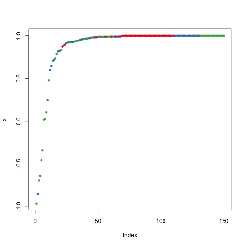

IRIS Flower Classification Prediction Application
========================================================
author: Coursera: Developing Data Products Student 
date: July  15 2014
transition: rotate
width: 1440
height: 900
Introduction 
========================================================

Welcome to the IRIS Flower Prediction Application. 
The purpose of this application is to help any flower
collector or hobbyist to accurately classify their IRIS flower collection. 

Features of this application: 
- Application has been trained on a wide variety of IRIS flower types
- Application uses a modern machine learning algorithm namely Random Forest
- Application has an almost perfect prediction record as measured by the confusion matrix
- Application is very easy to use

Instruction  
========================================================

It's so easy to use this application. These are the five steps to follow:

- #1 Take the following measurements of your IRIS Flower: Sepal Length and Width, Pedal Length and Width
- #2 Enter those 4 values into the left panel either directly or using the provided controls
- #3 Press the Submit button
- #4 Ensure that your data entered is accurate in the main panel and view the results of the Classification Prediction
- #5 Go back to #1 if you have another IRIS flower you wish to classify.

Random Forest Trained IRIS Model
========================================================
The plot shows the Error Margin which approaches zero.

 

Random Forest Confusion Matrix 
========================================================
This table shows the confusion matrix between different IRIS Species and 
the classification error. 
<small>

```
                Iris-setosa Iris-versicolor Iris-virginica class.error
Iris-setosa              50               0              0        0.00
Iris-versicolor           0              47              3        0.06
Iris-virginica            0               3             47        0.06
```
.</small>
